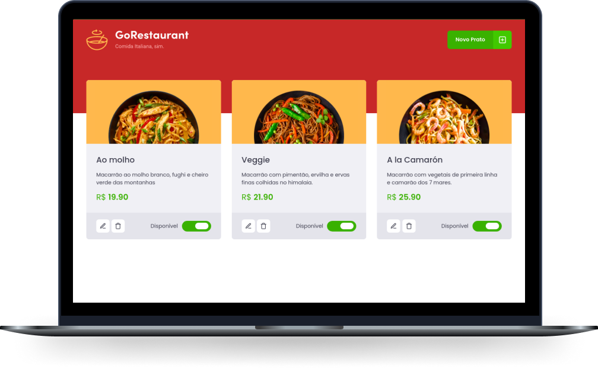

# Go Restaurant

## Preview

<h1 align="center">
    
</h1>

<br>

## 💻 Project

Foi desenvolvido o front-end de uma aplicação de um restaurante, o GoRestaurant. Utilizei uma fake API criada usando JSON Server. Dessa forma, foi possível
simular os dados a serem consumidos, exibir os pratos de comida existentes, permitir a criação de novos pratos, remoção e atualização dos pratos já cadastrados.

### Funcionalidades
- Listar os pratos de comida da fake API;
- Adicionar novos pratos de comida;
- Editar pratos de comida já existentes;
- Remover pratos de comida existentes;
- Alterar a disponibilidade dos pratos de comida.

### O desafio

O desafio consistia em realizar dois processos de migração: de Javascript para Typescript e de Class Components para Function Components.


## 🧬 Technologies

This project was developed using the following technologies:
- [React](https://reactjs.org)
- [TypeScript](https://www.typescriptlang.org/)
- [JSON Server](https://www.npmjs.com/package/json-server)
- [Styled Components](https://styled-components.com/)
- [Axios](https://www.npmjs.com/package/axios)
- [React-Router-Dom](https://reactrouter.com/web/guides/quick-start)
- [Yup](https://www.npmjs.com/package/yup?activeTab=readme)

## 🚀 Getting started

Clone the project and access the folder

```bash
$ git clone https://github.com/evertonvargas/GoRestaurant.git

```

Follow the steps below
```bash
# Install the dependencies
$ npm install or yarn

# Run the server
$ yarn server or npm run server 

# Start the project
$ yarn start or npm run start
```
